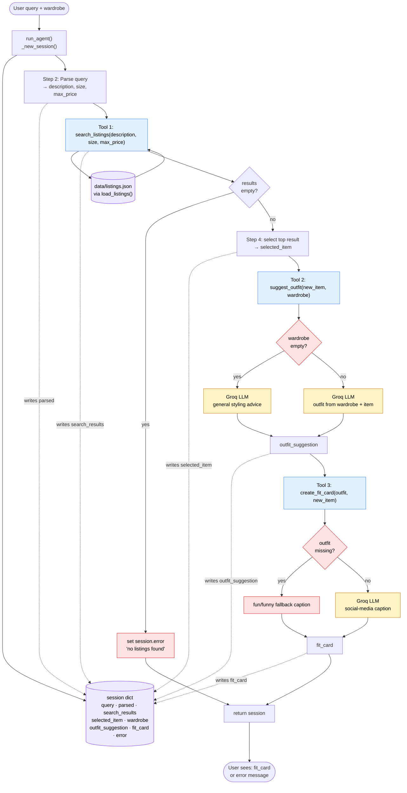

# FitFindr — planning.md

> Complete this document before writing any implementation code.
> Your spec and agent diagram are what you'll use to direct AI tools (Claude, Copilot, etc.) to generate your implementation — the more specific they are, the more useful the generated code will be.
> Your planning.md will be reviewed as part of your submission.
> Update it before starting any stretch features.

---

## Tools

List every tool your agent will use. For each tool, fill in all four fields.
You must have at least 3 tools. The three required tools are listed — add any additional tools below them.

### Tool 1: search_listings

**What it does:**
<!-- Describe what this tool does in 1–2 sentences -->
Searches the listing data to find matching description, size, and price.

**Input parameters:**
<!-- List each parameter, its type, and what it represents -->
- `description` (str): description of the clothing
- `size` (str): size of the product. example: M for medium, XL extra large, W28 for waist 28
- `max_price` (float): Max price of a piece of clothing the search should go up to.

**What it returns:**
<!-- Describe the return value — what fields does a result contain? -->
Returns a list of dictionaries of the best clothing, with the best matching at the top. the dictionary format is in the following order: 
     id, title, description, category, style_tags (list), size,
     condition, price (float), colors (list), brand, platform

**What happens if it fails or returns nothing:**
<!-- What should the agent do if no listings match? -->
If appropriate listing not found, return an empty list

---

### Tool 2: suggest_outfit

**What it does:**
<!-- Describe what this tool does in 1–2 sentences -->
Looking at the new clothing item, and the user's current wardrobe, the LLM creates an outfit suggestion, or a way to style the new clothing item if user has no wardrobe

**Input parameters:**
<!-- List each parameter, its type, and what it represents -->
- `new_item` (dict): New clothing item that was recieved from search_listings.data is in format     
                    id, title, description, category, style_tags (list), size,
                    condition, price (float), colors (list), brand, platform
- `wardrobe` (dict): User's wardrobe 

**What it returns:**
<!-- Describe the return value -->
Returns a desription string of what the LLM can create from new clothing item and wardrobe. Make it 1-2 sentences long. If wardrobe is empty, LLM gives suggestion to how to style new clothing item.

**What happens if it fails or returns nothing:**
<!-- What should the agent do if the wardrobe is empty or no outfit can be suggested? -->
If wardrobe is empty, give a suggestion on how to style new clothing item.
If no outfit suggestiong, give advice on new clothing item.

---

### Tool 3: create_fit_card

**What it does:**
<!-- Describe what this tool does in 1–2 sentences -->
Creates a short description that could be place on a social media about about the outfit suggestion highlighting the new clothing item that was given.

**Input parameters:**
<!-- List each parameter, its type, and what it represents -->
- `outfit` (str): Outfit suggestion, short description about the outfit you can use with new clothing item
- `new_item` (dict): new clothing item that will be highlighting in the return

**What it returns:**
<!-- Describe the return value -->
Short string description that highlights the new clothing item that fits a social media post.

**What happens if it fails or returns nothing:**
<!-- What should the agent do if the outfit data is incomplete? -->
If outfit data is incomplete, try descripting something fun about the new item, and make it funny/happy

---

### Additional Tools (if any)

<!-- Copy the block above for any tools beyond the required three -->

---

## Planning Loop

**How does your agent decide which tool to call next?**
<!-- Describe the logic your planning loop uses. What does it look at? What conditions change its behavior? How does it know when it's done? -->
1. Seach listing: After getting a description, size, and max price, search listings data and find the best matches.
     - If there are no matches, return an empty list, explain to user no listings found, and stop the loop
     - Return the list of best matching clothing data, with best matching at index 0.

2. Suggest outfit: After getting a list of matching clothing, select the best matching one, and create a outfit suggestiong using the users wardrobe.
     - If user has an empty wardrobe, suggest different ways to style the new clothing item.
     - return a string description on what outfit can be worn using the new clothing item.

3. Fit card: Using the suggestion from previous function, create a small caption that can be posted on social media that highlights the new clothing item.
     - If outfit data is incomplete, try descriping something fun about the new item, and make it funny/happy
     - Return the string caption.
---

## State Management

**How does information from one tool get passed to the next?**
<!-- Describe how your agent stores and accesses state within a session. What data is tracked? How is it passed between tool calls? -->
- Search Listing: Stores the best matching clothing items that best fit the user input, sorted best to worse. Best matching clothing item is passed along
- Suggest Outfit: using the best clothing item, and the user's wardrobe, create a outfit suggestion 1-2 sentences long. Best matching clothing item and outfit suggestion is passed along
- Fit Card: Using the outfit suggestion and new clothing item, a caption is create to fit a social media post that highlights the new clothing item.

---

## Error Handling

For each tool, describe the specific failure mode you're handling and what the agent does in response.

| Tool | Failure mode | Agent response |
|------|-------------|----------------|
| search_listings | No results match the query | return empty list, and no matching clothing message, exit loop|
| suggest_outfit | Wardrobe is empty | suggest different ways to style new clothing item|
| create_fit_card | Outfit input is missing or incomplete | describe something fun or cool about the new clothing item|

---

## Architecture

<!-- Draw a diagram of your agent showing how the components connect:
     User input → Planning Loop → Tools (search_listings, suggest_outfit, create_fit_card)
                                                                          ↕
                                                                   State / Session
     Show what triggers each tool, how state flows between them, and where error paths branch off.
     ASCII art, a Mermaid diagram (https://mermaid.js.org/syntax/flowchart.html), or an embedded
     sketch are all fine. You'll share this diagram with an AI tool when asking it to implement
     the planning loop and each individual tool. -->

**How to read it**
- **Blue** = your three tools. **Yellow** = Groq LLM calls inside tools 2 & 3. **Purple** = the `session` dict (single source of truth) and the listings data file. **Red** = error / fallback branches.
- Solid arrows = control flow (the planning loop order). Dotted arrows = state writes into the session dict.
- The loop is a **linear pipeline with one hard stop**: if `search_listings` returns `[]`, set `session.error` and return early — never call `suggest_outfit` on empty input. Tools 2 and 3 don't stop the loop; they branch *internally* to a fallback (empty wardrobe → general advice; missing outfit → fun caption) and always return a usable string.

---

## AI Tool Plan

<!-- For each part of the implementation below, describe:
     - Which AI tool you plan to use (Claude, Copilot, ChatGPT, etc.)
     - What you'll give it as input (which sections of this planning.md, your agent diagram)
     - What you expect it to produce
     - How you'll verify the output matches your spec before moving on

     "I'll use AI to help me code" is not a plan.
     "I'll give Claude my Tool 1 spec (inputs, return value, failure mode) and ask it to implement
     search_listings() using load_listings() from the data loader — then test it against 3 queries
     before trusting it" is a plan. -->

For this project, I am using Claude Code. For the input it will be to look at the tools, planning loop, state management, and error handling. Since a lot of detail are already in the tools.py file, I believe the AI tool will be able to under both my planning and the implementation. to verify the AI tool is correctly calling the tools, and not usings its own data, I will have it print out the loop as it goes to insure its valid. Will also remind Claude about the schemea about our data.

**Milestone 3 — Individual tool implementations:**

**Milestone 4 — Planning loop and state management:**

---

## A Complete Interaction (Step by Step)

Write out what a full user interaction looks like from start to finish — tool call by tool call. Use a specific example query.

User write down a particular item their looking for. LLM calls the search_listing() to finding any matching clothes, then takes the first response and calls
the suggest_outfit() with the new clothes and users wardrobe. After suggesting an outfit, LLM calls create_fit_card() that takes the suggestion and item and create 
a caption that would fit a social media post, highlighting the new item.

**Example user query:** "I'm looking for a vintage graphic tee under $30. I mostly wear baggy jeans and chunky sneakers. What's out there and how would I style it?"

**Step 1:**
<!-- What does the agent do first? Which tool is called? With what input? -->
Call the serach_listing function that takes in a description, size, and max price. This will return the most fitting item from the listings data.

**Step 2:**
<!-- What happens next? What was returned from step 1? What tool is called now? -->
Call the suggest_outfit function that takes in the most fitting item from search_listing, and the users wardrobe. Look at wardrobe_schema to look at how the data should
be formatted.

**Step 3:**
<!-- Continue until the full interaction is complete -->
After getting the suggestion, call the create_fit_card function with the suggestion, and the new item. This will create a caption for a social media post, highlighting the new
item that was retrieved

**Final output to user:**
<!-- What does the user actually see at the end? -->
In the end, the user will recieve a caption that highlights the new thrifted item the can post of social media.
